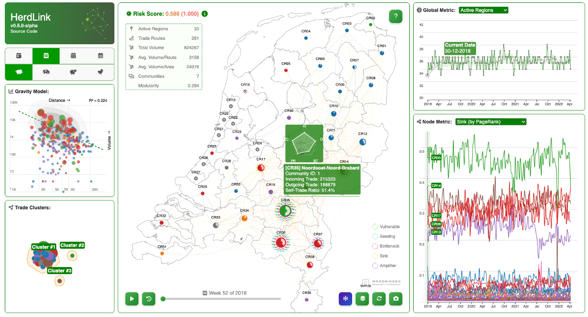
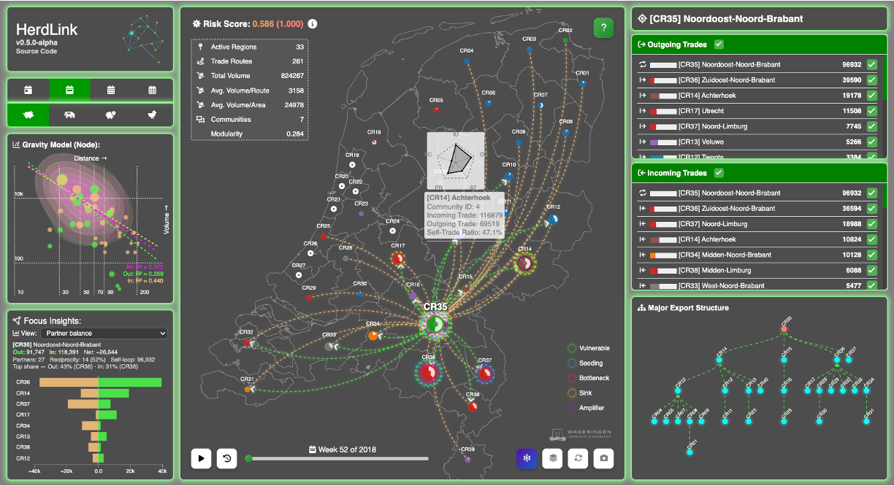

# HerdLink Web


HerdLink Web is a browser-based tool for exploring livestock trade networks in the Netherlands. It combines network views, regional map overlays, and time-based summaries so movement patterns and structural shifts are easier to inspect.

Normal mode             |  Focus mode
:-------------------------:|:-------------------------:
  |  

## Live Application

- [https://herdlink.nl](https://herdlink.nl)

## What It Does

- Renders regional trade networks with graph and map views.
- Switches between daily, weekly, monthly, and yearly aggregations.
- Highlights focus-mode trade flows, partner balance, and community structure.
- Tracks temporal metrics such as active regions, trade routes, modularity, and spectral radius.
- Exports the main network view as a PNG image.

## Project Layout

```text
.
├── index.html                    # Vite entry document
├── src/
│   ├── App.jsx                   # React shell and mount bridge
│   ├── components/               # Static layout components
│   └── styles/herdlink.css       # Application styles
├── public/
│   ├── assets/
│   │   ├── data/                 # Aggregated trade datasets
│   │   ├── files/herdlink/       # GeoJSON and SVG assets
│   │   ├── js/                   # D3 helpers and HerdLink runtime
│   │   └── screenshots/          # README images
│   ├── CNAME
│   └── favicon.ico
├── package.json
└── vite.config.js
```

## Development

Install dependencies:

```bash
npm install
```

Start the local dev server:

```bash
npm run dev
```

Create a production build:

```bash
npm run build
```

Preview the build locally:

```bash
npm run preview
```

## Architecture Notes

The page shell is rendered with React. The visualization engine remains a browser runtime in [`public/assets/js/herdlink-runtime.js`](public/assets/js/herdlink-runtime.js), where the D3 network logic, keyboard shortcuts, and export controls live.

This split keeps the layout easy to maintain while preserving the existing analysis workflow and asset format.

## License

This project is licensed under the **MIT License**. See [`LICENSE`](LICENSE) for details.
