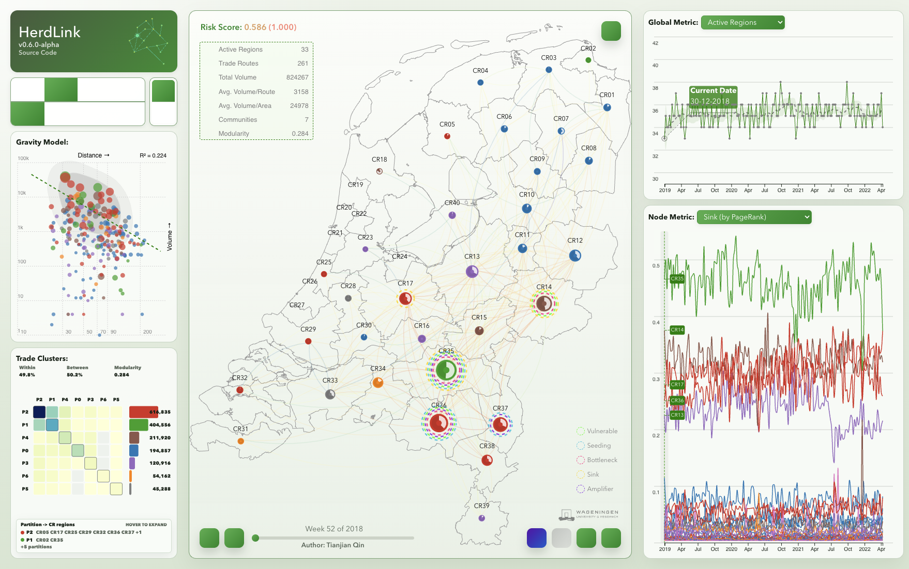
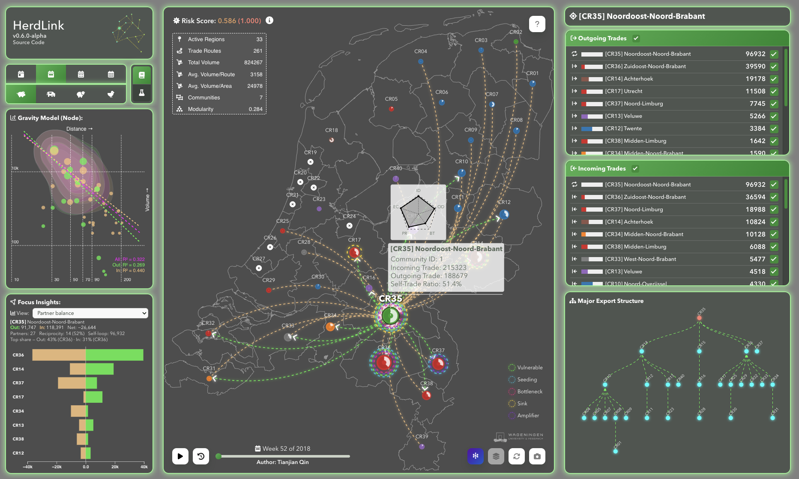
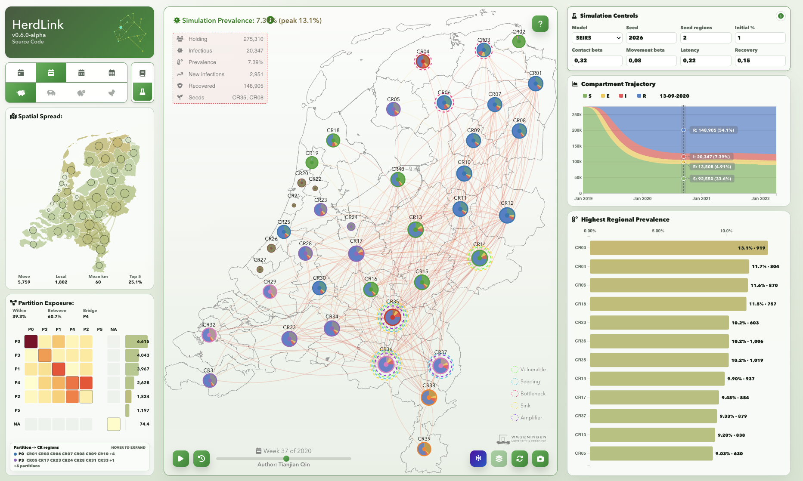
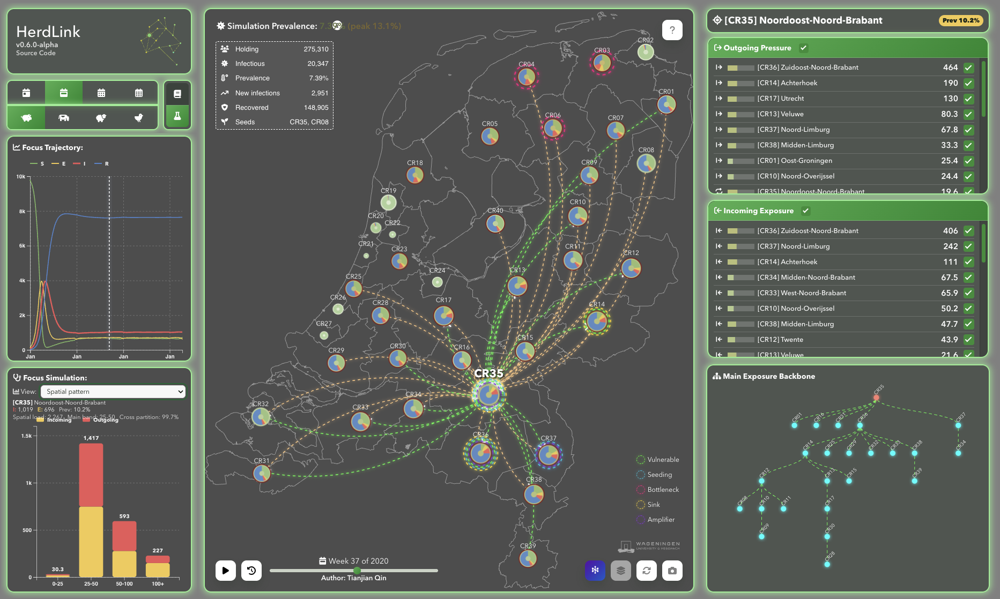

# HerdLink Web


HerdLink Web is a browser-based tool for exploring livestock trade networks in the Netherlands. It combines regional graph views, map overlays, temporal metrics, partition summaries, and simulation panels so movement structure and disease spread scenarios can be inspected in one workspace.

|  |  |
| :--: | :--: |
| **Ledger mode, global view**<br><br><sub>`public/assets/screenshots/ledger-global.png`</sub> | **Ledger mode, focus view**<br><br><sub>`public/assets/screenshots/ledger-focus.png`</sub> |
| **Sim mode, global view**<br><br><sub>`public/assets/screenshots/sim-global.png`</sub> | **Sim mode, focus view**<br><br><sub>`public/assets/screenshots/sim-focus.png`</sub> |

## Live Application

- [https://herdlink.nl](https://herdlink.nl)

## Main Features

- Trade ledger mode for daily, weekly, monthly, and yearly livestock movement summaries.
- Graph and map views with regional links, map layers, risk scores, and network metrics.
- Focus mode for inspecting one region's incoming and outgoing trade structure.
- Simulation mode with SEIR controls, compartment trajectory panels, regional prevalence maps, and focus node simulation insights.
- Partition and community views that summarize trade clustering, partition exposure, and CR-region mappings.
- Intro overlay with quick start notes, keyboard shortcuts, and guided shortcut callouts.
- PNG export for the main network visualization.

## Shortcuts

| Key | Action |
| --- | --- |
| `E` | Switch between trade ledger and simulation modes |
| `M` | Switch between map and graph views |
| `S` | Export a screenshot |
| `R` | Restore disabled links |
| `Q` | Exit focus mode |
| `H` | Open or close the help overlay |
| `Space` | Play or pause the time slider |
| `F` | Jump to the first time step |
| `←` / `→` | Step through time |
| `↑` / `↓` | Switch focal node |

## Project Layout

```text
.
├── index.html                    # Vite entry document
├── src/
│   ├── App.jsx                   # React shell and mount bridge
│   ├── components/               # Static layout components
│   └── styles/herdlink.css       # Application styles
├── public/
│   ├── assets/
│   │   ├── data/                 # Aggregated trade datasets
│   │   ├── files/herdlink/       # GeoJSON and SVG assets
│   │   ├── js/                   # D3 helpers and HerdLink runtime
│   │   └── screenshots/          # README images
│   ├── CNAME
│   └── favicon.ico
├── package.json
└── vite.config.js
```

## Development

Install dependencies:

```bash
npm install
```

Start the local dev server:

```bash
npm run dev
```

Create a production build:

```bash
npm run build
```

Preview the build locally:

```bash
npm run preview
```

## License

This project is licensed under the **MIT License**. See [`LICENSE`](LICENSE) for details.
