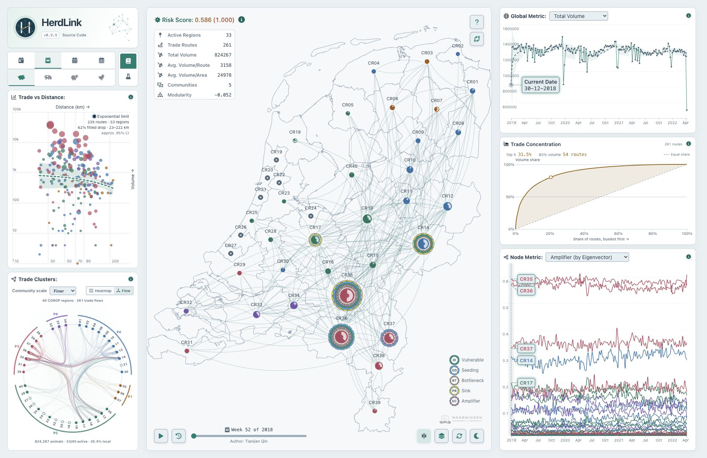
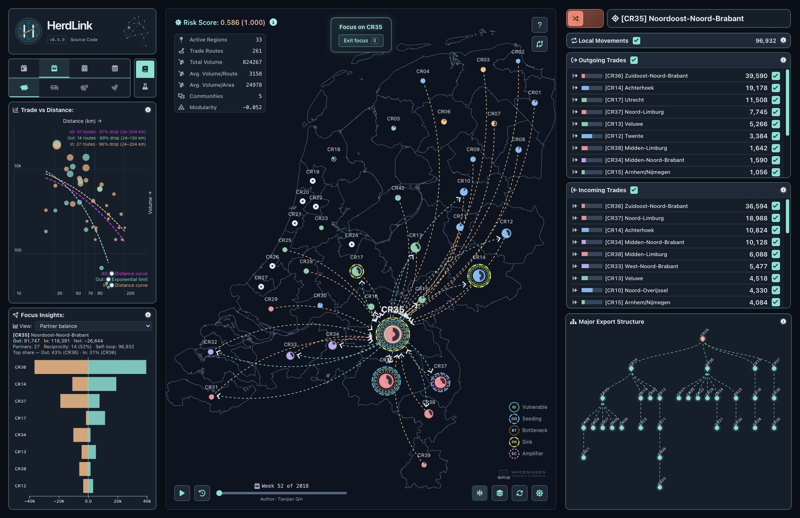
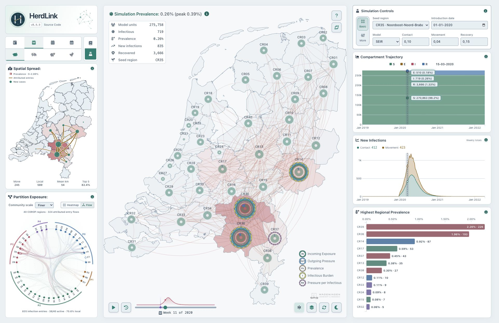
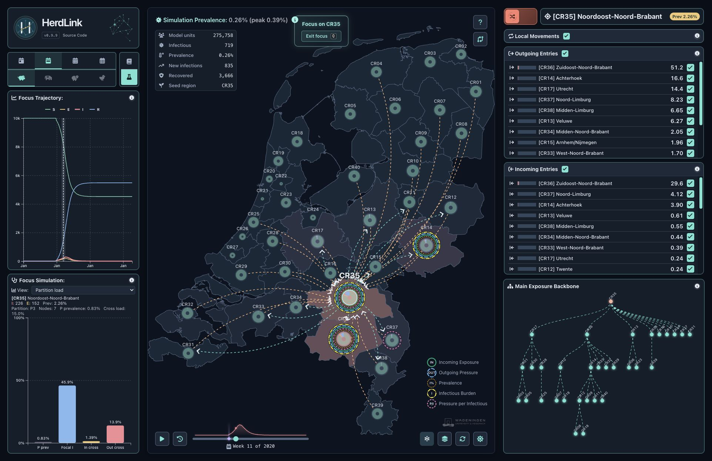

<h1></h1>


HerdLink Web is a browser-based tool for exploring livestock trade networks in the Netherlands. It combines regional graph views, map overlays, temporal metrics, partition summaries, and simulation panels so movement structure and disease spread scenarios can be inspected in one workspace.

The [graduate simulation guide](docs/simulation-teaching-guide.md) explains the engine, parameter units and intervention scenarios through equations, figures and worked exercises. The [LaTeX source](docs/simulation-teaching-guide.tex), [printable PDF](output/pdf/herdlink-simulation-teaching-guide.pdf) and [runnable two-region example](scripts/simulation-tutorial-example.mjs) accompany the guide.

|  |  |
| :--: | :--: |
| **Ledger mode, global view**<br><br><sub>`public/assets/screenshots/ledger-global.png`</sub> | **Ledger mode, focus view**<br><br><sub>`public/assets/screenshots/ledger-focus.png`</sub> |
| **Sim mode, global view**<br><br><sub>`public/assets/screenshots/sim-global.png`</sub> | **Sim mode, focus view**<br><br><sub>`public/assets/screenshots/sim-focus.png`</sub> |

## Live Application

- [https://herdlink.nl](https://herdlink.nl)

## Main Features

- Trade ledger mode for daily, weekly, monthly, and yearly livestock movement summaries.
- Graph and map views with regional links, map layers, risk scores, and network metrics.
- Focus mode for inspecting one region's incoming and outgoing trade structure.
- Generic deterministic simulation with daily SIR/SIS/SEIR/SEIRS controls, compartment trajectory panels, regional prevalence maps, and focus node simulation insights.
- Partition and community views that summarize trade clustering, partition exposure, and CR-region mappings.
- Help overlay with quick start notes, keyboard shortcuts, and interactive illustrations of regions, trade volume, and network paths.
- Comparison overlay with paired global and regional metrics, trajectories, and intervention effects in both modes.
- Light and dark themes that follow the system preference, with light as the default.
  The animated theme switch applies until the next system theme change or page load.

Seed region selects the single region that starts infected, with CR35 selected by
default. Initial infectious, exposed and recovered percentages define its state
at the start of the introduction day; the remaining share is susceptible. The
engine records this exact state separately before the first transition. Choosing
a seed region recomputes the simulation from the beginning.

The simulation is an uncalibrated mathematical scenario using a synthetic
population or a prepared fixed animal inventory. It uses the canonical daily ledger for every transition;
weekly, monthly and yearly views show bin-end states and summed daily infection
entries. The [model contract](docs/simulation-model.md) defines parameter units,
initialization, metrics and the evidence required for disease claims.
The [simulation assessment](docs/simulation-scientific-assessment.md) and
[population strategy](docs/population-strategy-assessment.md) record scientific
findings, assumptions and evidence limits.
The [population product contract](docs/population-products.md) defines the final
file consumed by HerdLink. Source preparation and research remain outside the
application. The control panel accepts a prepared inventory file. Private populations
remain in memory; scenario storage is blocked for them.

Trade ledger and simulation modes share one network and two controls for movement:

- Link availability changes an individual directed route for the displayed time
  interval. A coarse display edit covers the daily intervals inside that bin.
  Local movement checkboxes govern recorded movements within the region in both
  modes. Contact beta controls an independent local contact pathway.
- Imports and exports controls govern all movement to or from a region,
  starting at the displayed date and lasting until re-enabled. They include
  partners that appear at later dates. Recorded local movements follow their
  own checkbox; contact beta is independent. The searchable panel lists every
  node in the dataset.
  A timeline shows each region with restrictions anywhere in the schedule:
  teal allows both directions,
  salmon blocks exports, purple blocks imports, and amber blocks both. Hover a
  segment or change point for details. Click a change point to jump to its date,
  or the first time step on or after it at coarser time resolutions. Dates outside
  the replay range select the nearest endpoint. Closely spaced changes scroll
  horizontally, with region labels kept in view.
  In focus mode, the switch beside the region name selects this panel or the
  controls for individual links. Both sets of edits remain active when switching
  between control panels or between ledger and simulation modes.
  The All exports and All imports switches apply to every region, including
  regions outside the search results. A teal thumb on the right allows movement;
  a coral thumb on the left blocks it. A centered amber thumb means some regions
  are allowed and others are blocked. Selecting a mixed control allows every region.

A route between regions can operate when its link is available, its source can
export, and its destination can import. Ledger mode measures allowed routes by
recorded movement volume, while simulation route values show attributed
infection entries. The ledger route list keeps recorded volumes visible for blocked
routes, with the reason shown beside the partner name. Its bars show partner
distance and community; simulation bars show the partner's infectious share
at the bin end.

Ledger mode evaluates the selected aggregated records at their date labels.
Coarse ledger trade totals can miss restrictions within a bin; exact daily
retained-trade accounting requires the daily ledger or the evaluation script.
The simulation uses daily restrictions at every display resolution. Coarse
simulation charts sample states and can miss daily peaks.

Trade communities use one undirected graph of allowed interregional volume across the full
loaded period, with reciprocal routes added together. Broad (γ = 1) and Finer
(γ = 1.5) select two cached community scales. Membership, colors, and matrix
order stay fixed during replay. Scheduled restrictions apply at each
record's date; editing them can regroup the whole timeline, including earlier
dates. Matrix volumes and modularity describe the displayed date against those
fixed groups; modularity and mixing shares use interregional volume. Local trade
remains in the heatmap, flow view, and disease simulation. Scale changes
reuse simulation results. The [community methods](docs/trade-communities.md)
cover interpretation, limits, and performance checks.

Trade vs Distance plots recorded route volume against distance in kilometres.
Its fitted curve uses the untruncated Lévy-walk shape to describe typical trade
volume, with separate curves for imports and exports in focus mode. The
[methods and profiling notes](docs/distance-trade-fit.md) explain the fit,
its connection to the literature, and its limits.

Ledger hotspot scores use allowed routes between regions. Rings mark up to
three positive eligible scores per metric at the displayed date. Blocking
exports removes a region's Seeding and Bottleneck
marks; incoming routes can still support Vulnerable, Sink, or Amplifier marks.
Sink requires imports, while Amplifier considers connections in either
direction. Simulation rings show incoming exposure, outgoing pressure,
prevalence, infectious burden, and pressure per infectious model unit. Infection can
persist after movement stops; local transmission is separate from import and
export pressure.

Edits made in either mode can change disease outcomes from the selected step
onward. Earlier simulated states, regional model populations, and initial infections stay
fixed. Replay shows the controls active at each date. Restore all in either mode
clears both kinds of edits across every date; the simulation uses this restored
network when it runs.

Dated edits survive settings and time resolution changes. Each stored route
restriction governs one UTC day; coarse display edits create restrictions for
the days inside the selected bin. Node restrictions apply
to every day on or after their start date until a later permission change.
The schedules stay active when switching between ledger and simulation modes.

Seven [intervention presets](docs/network-scenarios.md) compare Open trade, Seed
containment, Trace Ring, Community Cordon, Hubs, Bridges, and Standstill. The
side panel contains presets with Target regions, Response delay, and Standstill
duration in Baseline view. Compare 3 lists comparison presets in the side panel
and provides independent controls in each column. The view switch sits above
Presets in the side panel. Custom sits inside Presets and opens three saved
scenario slots.
Defaults are three targets, a seven-day delay, and a 14-day Standstill.
Historical targeting uses 365 preceding days of canonical daily trade, while
tracing follows outgoing seed movements before response. Community scale controls
the cordon membership, and an independent target count controls
Hubs and Bridges. Compare disease outcomes alongside retained trade to account
for each policy's scope.

Set Introduction date beside Seed region in Simulation Controls. Changing the
date sets infection timing; existing restrictions keep their calendar dates.
Loading a preset selects its targets and builds its response schedule from that
date. Preset parameter changes reapply the selected preset after a 600 ms pause
and rerun the comparison with its new schedule. Response delay applies to all six
intervention presets; zero delay starts controls on the introduction date and
gives Trace Ring a seed-only target set. Target regions sets the Hubs and Bridges
selection count, and Standstill duration sets its time to reopening.

Disease compartments default to [synthetic model population units](docs/simulation-population.md)
scaled from trade activity. A prepared inventory reference retains its own
quantity, period, geography and assumptions. CBS pig census values describe agricultural activity
at business main addresses and provide the map's pig and holdings density layers.
Using them as geographic disease populations requires alignment with animal sites
and the movement data. The [KRD and GIAB assessment](docs/krd-population-assessment.md)
documents permitted capacity, site matching and the evidence needed for regional
stock estimates. Permit counts and the GIAB/KRD ratios do not supply dynamic
simulation populations.

Contact beta (0.10) is a daily integrated hazard, movement beta (0.04) is model
units per recorded animal, and progression (0.22), recovery (0.15) and SEIRS
waning (0.02) are daily exit fractions. These illustrative defaults put contact
transmission below recovery so continuing movement contributes to outbreak growth.
Response comparisons retain the daily shipment calendar and its uneven timing.
Published disease estimates need compatible units, endpoints and model
structure before translation; movement records alone cannot calibrate them.
Saved scenarios identify their daily model. Records using one transition per
displayed record remain stored and require explicit daily configuration before
they can be used with this engine.

Trajectory panels use smooth curves within each period of unchanged links.
Each intervention boundary uses a step to connect the last state
before the edit to the first state under it.

## Shortcuts

Press `C` to compare the original ledger with the current movement restrictions.
In simulation mode, both scenarios use the same model, seed, settings, and
population reference and vector; the original scenario allows all movement.
The Region panel opens with three regions ranked by their peak Original value
for the selected metric across the displayed timeline. Choose one to five rows,
each with its own chart and values for the inspected date. Each chart pairs
dashed Original and solid Intervention curves on the same scale.
Choose an individual region to inspect its trajectory and full statistics.
Compare 3 opens three columns with a shared date inspector
and chart scales. Overall and Regional selectors in Chart settings control their
respective charts across all three columns. The lock beside them is on by default
and keeps both selectors on the same metric. Unlock it to choose separate metrics,
including simulation metrics available only at regional scale. Regions selects
the same regions across all three columns. Ledger Compare 3 offers incoming,
outgoing, and retained movements. Simulation Compare 3 excludes retained movements.
Baseline comparisons also offer network structure, communities, and regional
centrality in Ledger mode. Retained movements counts allowed
animal movements, including local movements once; regional values count movements
sent by that region. Incoming and outgoing movements exclude local movements.
Comparison presets vary strategies,
target counts, response delays, and pause durations. Each column accepts a preset
or saved scenario; its controls rerun the comparison after a short pause.
The overlay's mode switch and `E` change the active application mode.

| Key | Action |
| --- | --- |
| `E` | Switch between trade ledger and simulation modes |
| `M` | Switch between map and graph views |
| `T` | Switch between light and dark themes |
| `R` | Restore all links and node movement permissions |
| `Q` | Exit focus mode |
| `H` | Open or close the help overlay |
| `C` | Open or close the intervention comparison |
| `Space` | Play or pause the time slider |
| `F` | Jump to the first time step |
| `←` / `→` | Step through time |
| `↑` / `↓` | Switch focal node |

## Project Layout

```text
.
├── index.html                    # Vite entry document
├── src/
│   ├── App.jsx                   # React shell and mount bridge
│   ├── assets/
│   │   ├── data/                 # Aggregated trade datasets
│   │   └── files/herdlink/       # GeoJSON and SVG assets
│   ├── components/               # Static layout components
│   ├── runtime/                  # Classic D3 helpers and HerdLink runtime
│   └── styles/herdlink.css       # Application styles
├── public/
│   ├── assets/
│   │   ├── js/                   # Graph and SVG helper assets
│   │   └── screenshots/          # README images
│   ├── CNAME
│   └── favicon.ico
├── package.json
└── vite.config.js
```

## Map Layers

The map layer menu offers a plain background, a light BRT map, and aerial imagery
from 2022. Major roads, water, province boundaries, place labels, and land cover
can be switched independently. The opacity control adjusts the background,
context overlays, and census colouring. Background imagery contains its own
roads, water, and labels.

Region colouring shows the analytical view, pig density, or pig holdings density.
Census colours follow the trade date's calendar year and share one linear scale
across 2018–2022. Zero and missing observations have separate appearances. The
census measures animals and businesses at their main establishment address;
interpret holdings as business counts at that address. Census definitions follow
each reference year, while the displayed COROP boundaries are from 2024. These
layers provide spatial context. The disease model uses ledger routes and
simulation settings, and regional links connect origin and destination regions.

- [Kadaster TOP250NL](https://www.pdok.nl/introductie/-/article/basisregistratie-topografie-brt-topnl)
  supplies the bundled context geometry in Dutch RD New coordinates. Land cover
  displays woodland, settlement, and sand classes.
  Place labels use the source's population threshold of 50,000. Source dates,
  licence, selections, and archive checksum are recorded in
  [geography-sources.json](src/assets/files/herdlink/layers/geography-sources.json).
- [CBS agricultural census](https://www.cbs.nl/nl-nl/cijfers/detail/80781ned)
  supplies published COROP pig and holdings totals. Densities divide these totals
  by the same year's published land area, excluding water. The
  [census metadata](src/assets/data/pig-census.json) records source tables,
  reference dates, and land-area survey vintages.
- PDOK serves [BRT background tiles](https://www.pdok.nl/ogc-webservices/-/article/basisregistratie-topografie-achtergrondkaarten-brt-a-)
  and [aerial imagery](https://www.pdok.nl/ogc-webservices/-/article/pdok-luchtfoto-rgb-open-)
  on demand. They require an internet connection.

The source data use CC BY 4.0. The MIT licence applies to the application code.

Rebuild the bundled data with Python 3:

```bash
python3 scripts/fetch-map-geography.py
python3 scripts/fetch-pig-census.py
```

Validate the bundled data and map calculations:

```bash
python3 scripts/fetch-map-geography.py --check
python3 scripts/fetch-pig-census.py --check
node --test tests/map-layers.test.js
```

## Cursors

The [cursor set](src/assets/cursors) contains six original SVGs with black fills,
rounded white outlines, and a pink and orange glow: arrow, hand, text, move, help, and unavailable.
[Cursor styles](src/styles/cursors.css) map them to the application controls using
native CSS. Each SVG has a 64 × 64 canvas and a defined click point. Touch devices
and forced colour mode retain system cursors. The artwork uses the project licence.
Open the [cursor preview](src/assets/cursors/preview.html) to inspect and try the set.

## Development

Install dependencies:

```bash
npm install
```

Start the local dev server:

```bash
npm run dev
```

Create a production build:

```bash
npm run build
```

Preview the build locally:

```bash
npm run preview
```

## Deployment and caching

Vite gives the app, classic runtime scripts, styles, datasets, geography, and
logos filenames based on their contents. Each app build refers to its own asset
URLs. The runtime loads its classic scripts in dependency order and resolves
bundled data through `src/assetUrls.js`.

SimpleKeyboard JavaScript and CSS use release 3.8.187. D3 uses 6.7.0.
Bootstrap, Vivus, and LeaderLine also use exact release URLs. The FontAwesome
kit keeps its licensed icon selection; its release version is controlled in
the [kit settings](https://docs.fontawesome.com/web/setup/use-kit#additional-settings).

The Pages workflow stores published assets on `herdlink-pages-assets` and includes
them in each deployment. Open tabs load their runtime and data from this archive.
The archive is written before Pages publishes the site. A generated filename with different contents stops the
deployment. Files declared in `public/assets` keep their fixed paths and may
be replaced.

Initial archive creation requires the `github-pages` artifact from the latest
successful deployment. If that artifact is unavailable, deployment stops with
the run ID. Seed the archive from a trusted copy of the published assets before
deploying. The archive persists in Git storage. Keep the archive branch and its
asset files intact.
Its files count toward GitHub Pages' published site size limit.

GitHub Pages manages HTTP caching through its host-wide response headers.
Content hashing keeps asset versions separate; the entry HTML follows Pages'
cache policy. Per-file policies require a CDN or host with response-header
controls:

| Resource | Cache-Control |
| --- | --- |
| HTML | `no-cache` |
| Assets with content hashes | `public, max-age=31536000, immutable` |

`no-cache` requires validation before a cached response is reused. See the
[HTTP caching guide](https://developer.mozilla.org/en-US/docs/Web/HTTP/Guides/Caching)
and [GitHub's response about custom Pages headers](https://github.com/orgs/community/discussions/54257).

Check the build and deployment asset rules with:

```bash
node --test tests/*.test.js
npm run build
```

## License

This project is licensed under the **MIT License**. See [`LICENSE`](LICENSE) for details.
